# Cryptocurrency Technical Analysis Processor

A comprehensive, high-performance technical analysis toolkit for cryptocurrency data processing, featuring GPU-accelerated calculations and optimized indicator implementations.

## 🚀 Overview

This project provides a complete solution for processing cryptocurrency market data and calculating technical indicators. It features a main processor class (`CryptoTAProcessor`) that handles data loading, indicator calculation, and feature engineering, along with a highly optimized `TechnicalIndicators` class that implements various technical analysis indicators using modern acceleration technologies.

### System Architecture

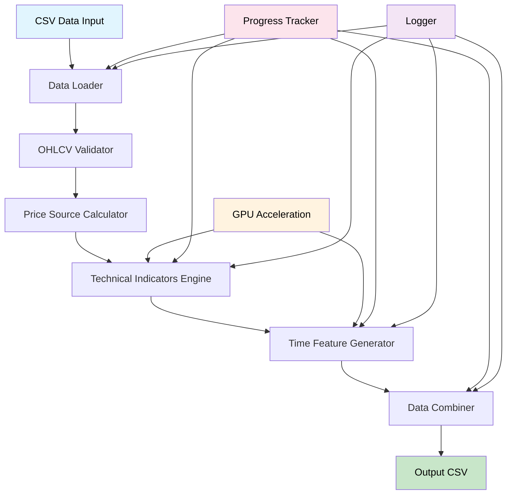
```mermaid
graph TB
    A[CSV Data Input] --> B[Data Loader]
    B --> C[OHLCV Validator]
    C --> D[Price Source Calculator]
    D --> E[Technical Indicators Engine]
    E --> F[Time Feature Generator]
    F --> G[Data Combiner]
    G --> H[Output CSV]
    
    I[GPU Acceleration] --> E
    I --> F
    
    J[Progress Tracker] --> B
    J --> E
    J --> F
    J --> G
    
    K[Logger] --> B
    K --> E
    K --> F
    K --> G
    
    style A fill:#e1f5fe,color:#000000
    style H fill:#c8e6c9,color:#000000
    style I fill:#fff3e0,color:#000000
    style J fill:#fce4ec,color:#000000
    style K fill:#f3e5f5,color:#000000
```

### Data Processing Pipeline

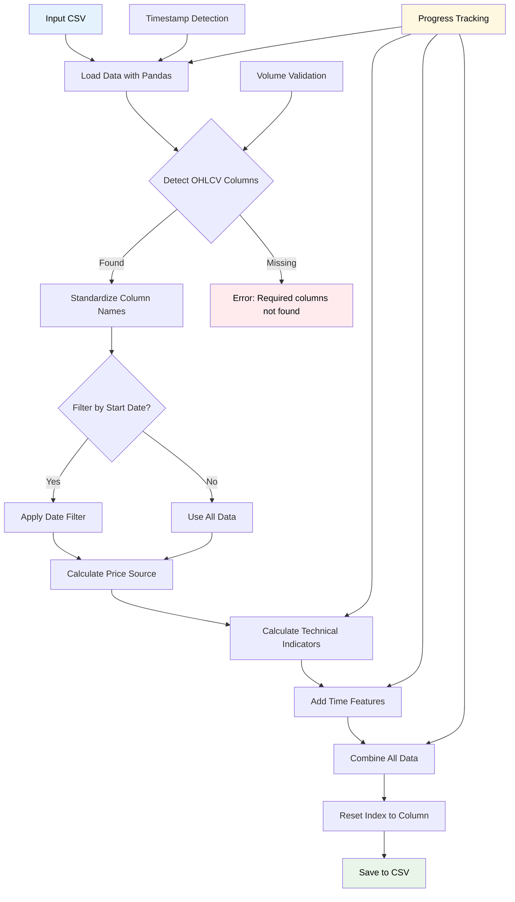
```mermaid
flowchart TD
    A[Input CSV] --> B[Load Data with Pandas]
    B --> C{Detect OHLCV Columns}
    C -->|Found| D[Standardize Column Names]
    C -->|Missing| E[Error: Required columns not found]
    D --> F{Filter by Start Date?}
    F -->|Yes| G[Apply Date Filter]
    F -->|No| H[Use All Data]
    G --> I[Calculate Price Source]
    H --> I
    I --> J[Calculate Technical Indicators]
    J --> K[Add Time Features]
    K --> L[Combine All Data]
    L --> M[Reset Index to Column]
    M --> N[Save to CSV]
    
    O[Timestamp Detection] --> B
    P[Volume Validation] --> C
    Q[Progress Tracking] --> B
    Q --> J
    Q --> K
    Q --> L
    
    style A fill:#e3f2fd,color:#000000
    style N fill:#e8f5e8,color:#000000
    style E fill:#ffebee,color:#000000
    style Q fill:#fff8e1,color:#000000
```

### Price Source Calculation Flow

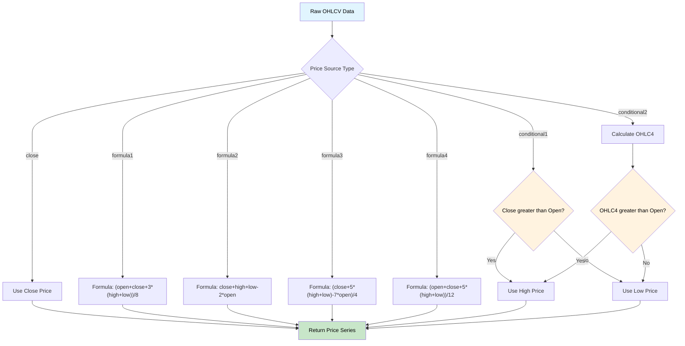
```mermaid
flowchart TD
    A["Raw OHLCV Data"] --> B{"Price Source Type"}

    B -->|close| C["Use Close Price"]
    B -->|formula1| D["Formula: (open+close+3*(high+low))/8"]
    B -->|formula2| E["Formula: close+high+low-2*open"]
    B -->|formula3| F["Formula: (close+5*(high+low)-7*open)/4"]
    B -->|formula4| G["Formula: (open+close+5*(high+low))/12"]
    B -->|conditional1| H{"Close greater than Open?"}
    H -->|Yes| I["Use High Price"]
    H -->|No| J["Use Low Price"]
    B -->|conditional2| K["Calculate OHLC4"]
    K --> L{"OHLC4 greater than Open?"}
    L -->|Yes| I
    L -->|No| J

    C --> M["Return Price Series"]
    D --> M
    E --> M
    F --> M
    G --> M
    I --> M
    J --> M

    style A fill:#e1f5fe,color:#000000
    style M fill:#c8e6c9,color:#000000
    style H fill:#fff3e0,color:#000000
    style L fill:#fff3e0,color:#000000
```

### Key Features

- **High-Performance Computing**: GPU acceleration via PyTorch, JAX, and Numba
- **Comprehensive Indicators**: 30+ technical indicators with multiple variants
- **Intelligent Data Processing**: Automatic OHLCV column detection and validation
- **Multiple Price Sources**: Support for various price calculation formulas
- **Time-Aware Features**: Adaptive temporal features for machine learning
- **Robust Error Handling**: Numerical stability and graceful fallbacks
- **Progress Tracking**: Real-time processing feedback

## 📁 Project Structure

```
├── process_single.py    # Main processor class for data processing
├── ta.py               # Technical indicators implementations
└── README.md           # This documentation
```

## 🛠️ Core Components

### 1. CryptoTAProcessor (process_single.py)

The main class responsible for processing cryptocurrency CSV data and generating technical indicators.

#### Key Responsibilities:
- **Data Loading & Validation**: Automatic OHLCV column detection
- **Technical Indicator Calculation**: Orchestrates indicator computations
- **Feature Engineering**: Adds time-based features for ML applications
- **Output Generation**: Saves processed data to CSV format

#### Key Methods:
- `load_data()`: Loads and preprocesses CSV data
- `calculate_technical_indicators()`: Core indicator calculation engine
- `add_time_features()`: Adds temporal features based on timeframe
- `process_and_save()`: Main execution pipeline
- `_get_price_data()`: Calculates various price source formulas

### 2. TechnicalIndicators (ta.py)

A highly optimized class containing implementations of various technical indicators with GPU acceleration.

#### Performance Optimizations:
- **PyTorch**: GPU acceleration for tensor operations
- **JAX**: JIT compilation for mathematical computations
- **Numba**: CPU optimization with parallel processing
- **Vectorization**: Batch processing for improved performance

## 📊 Technical Indicators

### Moving Averages
| Indicator | Description | GPU Accelerated | Multiple Periods |
|-----------|-------------|-----------------|------------------|
| **SMA** | Simple Moving Average | ✅ | ✅ |
| **EMA** | Exponential Moving Average | ✅ | ✅ |
| **WMA** | Weighted Moving Average | ✅ | ✅ |
| **HMA** | Hull Moving Average | ✅ | ✅ |
| **THMA** | Triple Hull Moving Average | ✅ | ✅ |
| **DEMA** | Double Exponential MA | ✅ | ✅ |
| **TEMA** | Triple Exponential MA | ✅ | ✅ |
| **LSMA** | Least Squares MA | ✅ | ✅ |
| **RMA** | RSI Moving Average | ✅ | ✅ |
| **SMMA** | Smoothed Moving Average | ✅ | ✅ |
| **VWMA** | Volume-Weighted MA | ✅ | ✅ |
| **EVWMA** | Exponential VWMA | ✅ | ✅ |
| **ZLEMA** | Zero-Lag EMA | ✅ | ✅ |
| **T3** | Tillson T3 MA | ✅ | ✅ |
| **GMA** | Geometric MA | ✅ | ✅ |
| **WWMA** | Welles Wilder MA | ✅ | ✅ |
| **CMA** | Corrective MA | ✅ | ✅ |
| **GMMA** | Geometric Mean MA | ✅ | ✅ |
| **EALF** | Ehler's Adaptive Laguerre Filter | ✅ | ✅ |
| **ELF** | Ehler's Laguerre Filter | ✅ | ✅ |
| **REMA** | Range EMA | ✅ | ✅ |
| **SWMA** | Sine-Weighted MA | ✅ | ✅ |
| **MAMA** | MESA Adaptive MA | ✅ | ✅ |
| **FAMA** | Following Adaptive MA | ✅ | ✅ |
| **HKAMA** | Hilbert KAMA | ✅ | ✅ |
| **EDMA** | Enhanced DMA | ✅ | ✅ |

### Momentum Indicators
| Indicator | Description | GPU Accelerated |
|-----------|-------------|-----------------|
| **RSI** | Relative Strength Index | ✅ |
| **MACD** | Moving Average Convergence Divergence | ✅ |
| **CCI** | Commodity Channel Index | ✅ |
| **MOM** | Momentum | ✅ |
| **CMO** | Chande Momentum Oscillator | ✅ |
| **TSI** | True Strength Index | ✅ |

### Volume Indicators
| Indicator | Description | GPU Accelerated |
|-----------|-------------|-----------------|
| **OBV** | On Balance Volume | ✅ |
| **RVSI** | Relative Volume Strength Index | ✅ |
| **VWMA** | Volume-Weighted Moving Average | ✅ |

### Oscillators
| Indicator | Description | GPU Accelerated |
|-----------|-------------|-----------------|
| **Stoch RSI** | Stochastic RSI | ✅ |
| **Williams %R** | Williams %R | ✅ |
| **AO** | Awesome Oscillator | ✅ |
| **APO** | Absolute Price Oscillator | ✅ |

### Specialized Indicators
| Indicator | Description | GPU Accelerated |
|-----------|-------------|-----------------|
| **KDJ** | KDJ Stochastic Oscillator | ✅ |
| **MAMA/FAMA** | MESA Adaptive MAs | ✅ |
| **Volatility Index** | Realized Volatility | ✅ |
| **RSI Divergence** | Divergence Signals | ✅ |
| **Savitzky-Golay** | Polynomial Smoothing | ✅ |

### Technical Indicator Calculation Flows

#### Simple Moving Average (SMA) Calculation

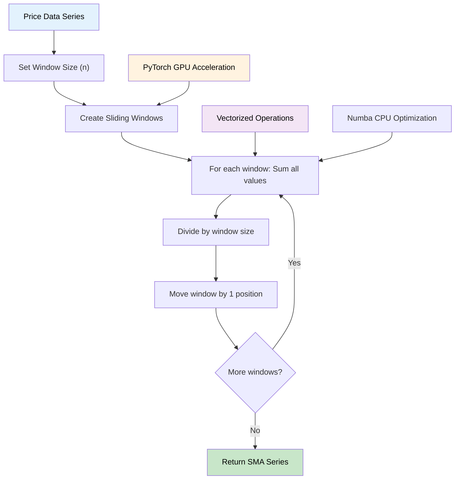
```mermaid
flowchart TD
    A["Price Data Series"] --> B["Set Window Size (n)"]
    B --> C["Create Sliding Windows"]
    C --> D["For each window: Sum all values"]
    D --> E["Divide by window size"]
    E --> F["Move window by 1 position"]
    F --> G{"More windows?"}
    G -->|Yes| D
    G -->|No| H["Return SMA Series"]

    I["PyTorch GPU Acceleration"] --> C
    J["Vectorized Operations"] --> D
    K["Numba CPU Optimization"] --> D

    style A fill:#e3f2fd,color:#000000
    style H fill:#c8e6c9,color:#000000
    style I fill:#fff3e0,color:#000000
    style J fill:#f3e5f5,color:#000000
```

#### Exponential Moving Average (EMA) Calculation

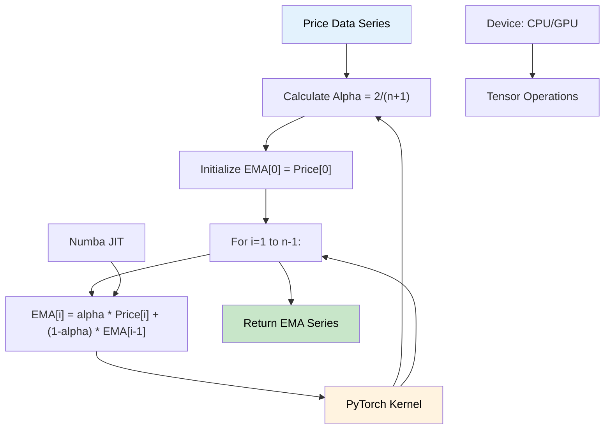
```mermaid
flowchart TD
    A["Price Data Series"] --> B["Calculate Alpha = 2/(n+1)"]
    B --> C["Initialize EMA[0] = Price[0]"]
    C --> D["For i=1 to n-1:"]
    D --> E["EMA[i] = alpha * Price[i] + (1-alpha) * EMA[i-1]"]
    F["Return EMA Series"]

    G["PyTorch Kernel"] --> B
    H["Numba JIT"] --> E
    I["Device: CPU/GPU"] --> J["Tensor Operations"]

    D --> F
    E --> G
    G --> D

    style A fill:#e3f2fd,color:#000000
    style F fill:#c8e6c9,color:#000000
    style G fill:#fff3e0,color:#000000
```

#### Hull Moving Average (HMA) Calculation

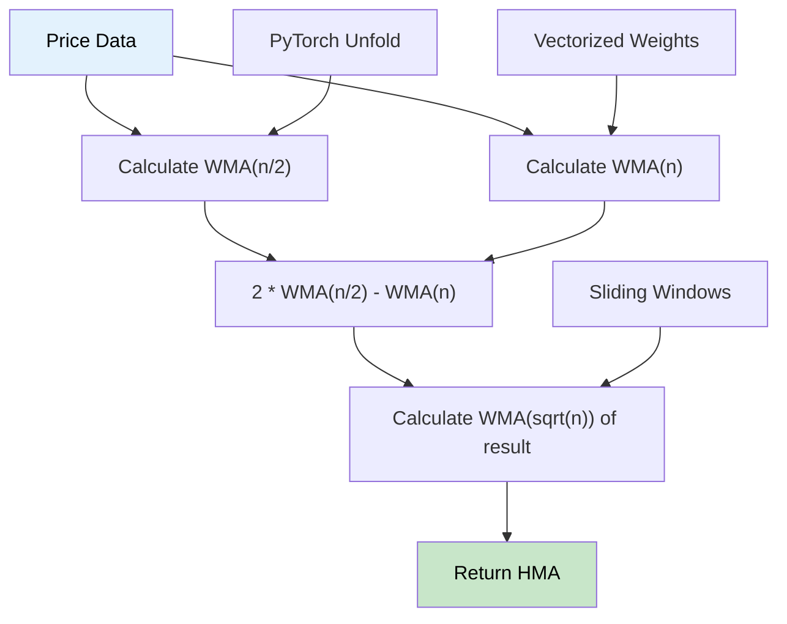
```mermaid
flowchart TD
    A["Price Data"] --> B["Calculate WMA(n/2)"]
    A --> C["Calculate WMA(n)"]
    B --> D["2 * WMA(n/2) - WMA(n)"]
    C --> D
    D --> E["Calculate WMA(sqrt(n)) of result"]
    E --> F["Return HMA"]

    G["PyTorch Unfold"] --> B
    H["Vectorized Weights"] --> C
    I["Sliding Windows"] --> E

    style A fill:#e3f2fd,color:#000000
    style F fill:#c8e6c9,color:#000000
```

#### RSI (Relative Strength Index) Calculation

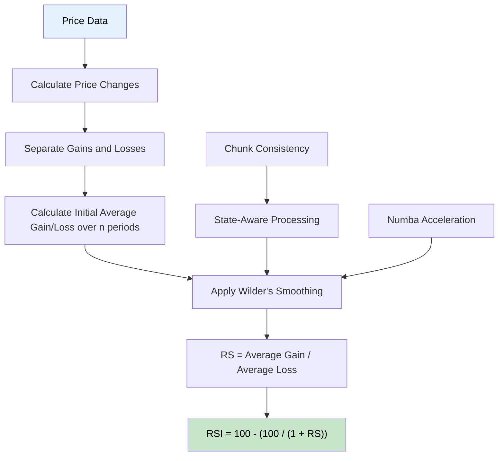
```mermaid
flowchart TD
    A["Price Data"] --> B["Calculate Price Changes"]
    B --> C["Separate Gains and Losses"]
    C --> D["Calculate Initial Average Gain/Loss over n periods"]
    D --> E["Apply Wilder's Smoothing"]
    E --> F["RS = Average Gain / Average Loss"]
    F --> G["RSI = 100 - (100 / (1 + RS))"]

    H["State-Aware Processing"] --> E
    I["Numba Acceleration"] --> E
    J["Chunk Consistency"] --> H

    style A fill:#e3f2fd,color:#000000
    style G fill:#c8e6c9,color:#000000
```

#### MACD (Moving Average Convergence Divergence) Calculation

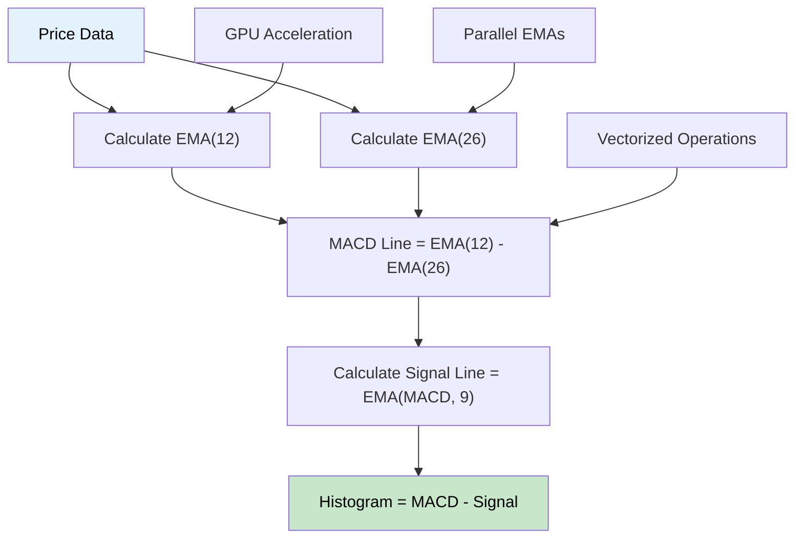
```mermaid
flowchart TD
    A["Price Data"] --> B["Calculate EMA(12)"]
    A --> C["Calculate EMA(26)"]
    B --> D["MACD Line = EMA(12) - EMA(26)"]
    C --> D
    D --> E["Calculate Signal Line = EMA(MACD, 9)"]
    E --> F["Histogram = MACD - Signal"]

    G["GPU Acceleration"] --> B
    H["Parallel EMAs"] --> C
    I["Vectorized Operations"] --> D

    style A fill:#e3f2fd,color:#000000
    style F fill:#c8e6c9,color:#000000
```

#### KDJ Stochastic Oscillator Calculation

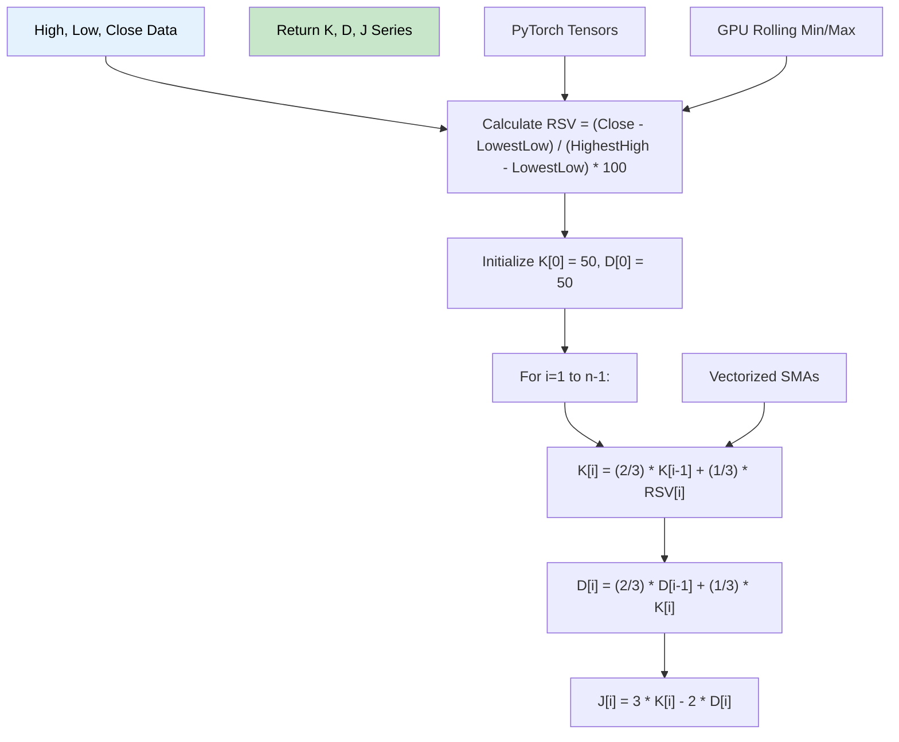
```mermaid
flowchart TD
    A["High, Low, Close Data"] --> B["Calculate RSV = (Close - LowestLow) / (HighestHigh - LowestLow) * 100"]
    B --> C["Initialize K[0] = 50, D[0] = 50"]
    C --> D["For i=1 to n-1:"]
    D --> E["K[i] = (2/3) * K[i-1] + (1/3) * RSV[i]"]
    E --> F["D[i] = (2/3) * D[i-1] + (1/3) * K[i]"]
    F --> G["J[i] = 3 * K[i] - 2 * D[i]"]
    H["Return K, D, J Series"]

    I["PyTorch Tensors"] --> B
    J["GPU Rolling Min/Max"] --> B
    K["Vectorized SMAs"] --> E

    style A fill:#e3f2fd,color:#000000
    style H fill:#c8e6c9,color:#000000
```

#### Williams %R Calculation

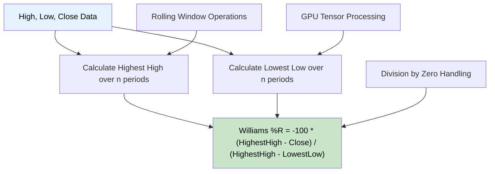
```mermaid
flowchart TD
    A["High, Low, Close Data"] --> B["Calculate Highest High over n periods"]
    A --> C["Calculate Lowest Low over n periods"]
    B --> D["Williams %R = -100 * (HighestHigh - Close) / (HighestHigh - LowestLow)"]
    C --> D

    E["Rolling Window Operations"] --> B
    F["GPU Tensor Processing"] --> C
    G["Division by Zero Handling"] --> D

    style A fill:#e3f2fd,color:#000000
    style D fill:#c8e6c9,color:#000000
```

#### On Balance Volume (OBV) Calculation

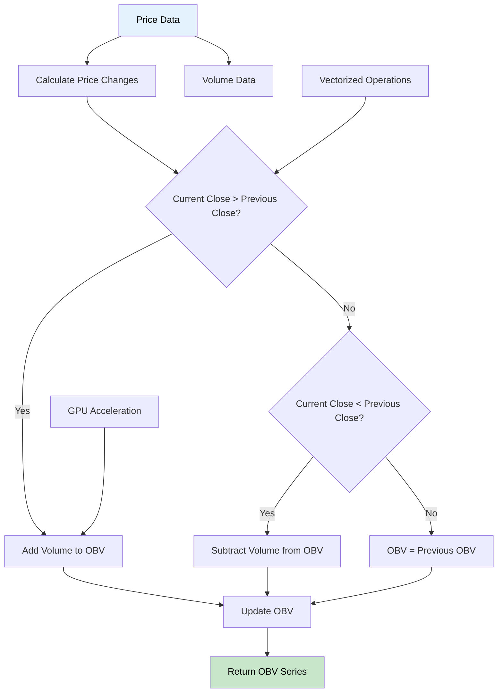
```mermaid
flowchart TD
    A["Price Data"] --> B["Calculate Price Changes"]
    A --> C["Volume Data"]
    B --> D{"Current Close > Previous Close?"}
    D -->|Yes| E["Add Volume to OBV"]
    D -->|No| F{"Current Close < Previous Close?"}
    F -->|Yes| G["Subtract Volume from OBV"]
    F -->|No| H["OBV = Previous OBV"]
    E --> I["Update OBV"]
    G --> I
    H --> I
    I --> J["Return OBV Series"]

    K["Vectorized Operations"] --> D
    L["GPU Acceleration"] --> E

    style A fill:#e3f2fd,color:#000000
    style J fill:#c8e6c9,color:#000000
```

#### RVSI (Relative Volume Strength Index) Calculation

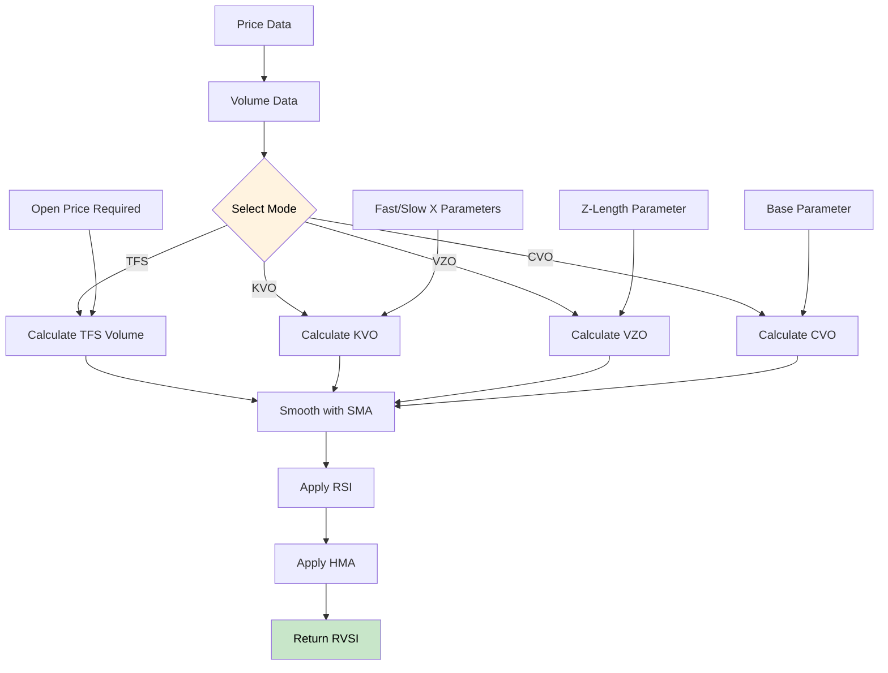
```mermaid
flowchart TD
    A["Price Data"] --> B["Volume Data"]
    B --> C{"Select Mode"}
    C -->|TFS| D["Calculate TFS Volume"]
    C -->|KVO| E["Calculate KVO"]
    C -->|VZO| F["Calculate VZO"]
    C -->|CVO| G["Calculate CVO"]

    D --> H["Smooth with SMA"]
    E --> H
    F --> H
    G --> H
    H --> I["Apply RSI"]
    I --> J["Apply HMA"]
    J --> K["Return RVSI"]

    L["Open Price Required"] --> D
    M["Fast/Slow X Parameters"] --> E
    N["Z-Length Parameter"] --> F
    O["Base Parameter"] --> G

    style C fill:#fff3e0,color:#000000
    style K fill:#c8e6c9,color:#000000
```

#### Savitzky-Golay Filter Calculation

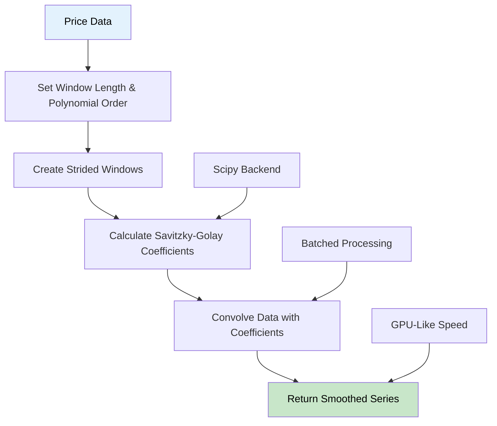
```mermaid
flowchart TD
    A["Price Data"] --> B["Set Window Length & Polynomial Order"]
    B --> C["Create Strided Windows"]
    C --> D["Calculate Savitzky-Golay Coefficients"]
    D --> E["Convolve Data with Coefficients"]
    E --> F["Return Smoothed Series"]

    G["Scipy Backend"] --> D
    H["Batched Processing"] --> E
    I["GPU-Like Speed"] --> F

    style A fill:#e3f2fd,color:#000000
    style F fill:#c8e6c9,color:#000000
```

#### Volume-Weighted Moving Average (VWMA) Calculation

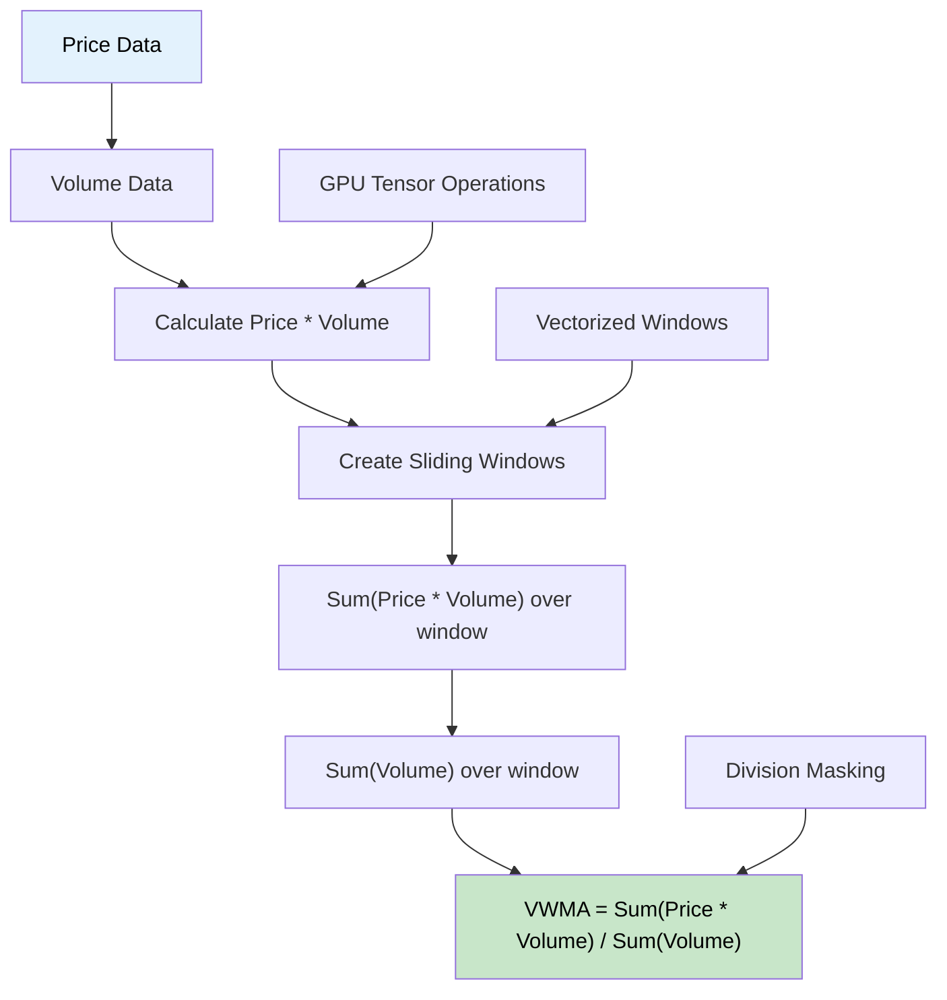
```mermaid
flowchart TD
    A["Price Data"] --> B["Volume Data"]
    B --> C["Calculate Price * Volume"]
    C --> D["Create Sliding Windows"]
    D --> E["Sum(Price * Volume) over window"]
    E --> F["Sum(Volume) over window"]
    F --> G["VWMA = Sum(Price * Volume) / Sum(Volume)"]

    H["GPU Tensor Operations"] --> C
    I["Vectorized Windows"] --> D
    J["Division Masking"] --> G

    style A fill:#e3f2fd,color:#000000
    style G fill:#c8e6c9,color:#000000
```

#### Awesome Oscillator (AO) Calculation

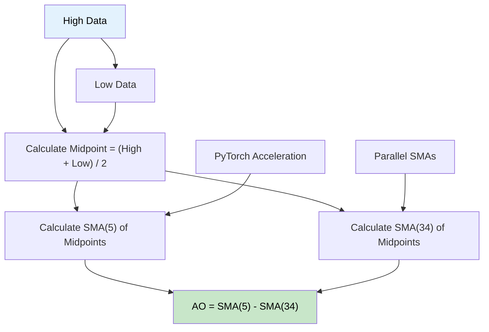
```mermaid
flowchart TD
    A["High Data"] --> B["Calculate Midpoint = (High + Low) / 2"]
    A --> C["Low Data"]
    C --> B
    B --> D["Calculate SMA(5) of Midpoints"]
    B --> E["Calculate SMA(34) of Midpoints"]
    D --> F["AO = SMA(5) - SMA(34)"]
    E --> F

    G["PyTorch Acceleration"] --> D
    H["Parallel SMAs"] --> E

    style A fill:#e3f2fd,color:#000000
    style F fill:#c8e6c9,color:#000000
```

#### Stochastic RSI Calculation

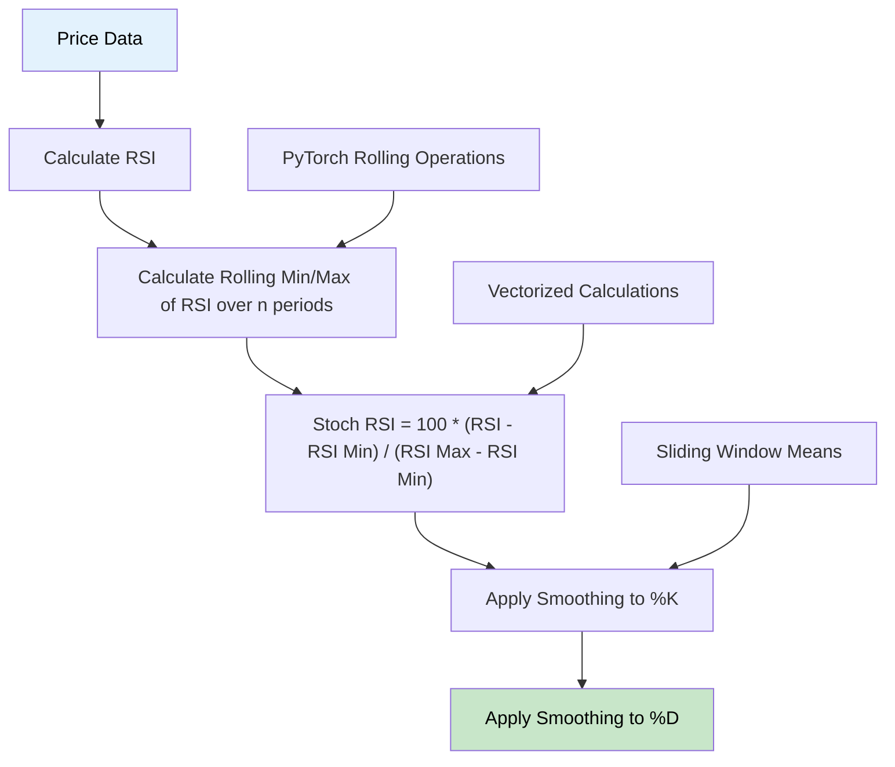
```mermaid
flowchart TD
    A["Price Data"] --> B["Calculate RSI"]
    B --> C["Calculate Rolling Min/Max of RSI over n periods"]
    C --> D["Stoch RSI = 100 * (RSI - RSI Min) / (RSI Max - RSI Min)"]
    D --> E["Apply Smoothing to %K"]
    E --> F["Apply Smoothing to %D"]

    G["PyTorch Rolling Operations"] --> C
    H["Vectorized Calculations"] --> D
    I["Sliding Window Means"] --> E

    style A fill:#e3f2fd,color:#000000
    style F fill:#c8e6c9,color:#000000
```

### Performance Optimization Architecture

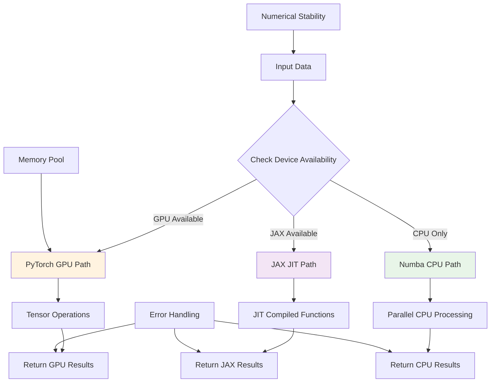
```mermaid
graph TD
    A[Input Data] --> B{Check Device Availability}
    B -->|GPU Available| C[PyTorch GPU Path]
    B -->|JAX Available| D[JAX JIT Path]
    B -->|CPU Only| E[Numba CPU Path]
    
    C --> F[Tensor Operations]
    D --> G[JIT Compiled Functions]
    E --> H[Parallel CPU Processing]
    
    F --> I[Return GPU Results]
    G --> J[Return JAX Results]
    H --> K[Return CPU Results]
    
    L[Memory Pool] --> C
    M[Numerical Stability] --> A
    N[Error Handling] --> I
    N --> J
    N --> K
    
    style C fill:#fff3e0
    style D fill:#f3e5f5
    style E fill:#e8f5e8
```

### Time Feature Generation Flow

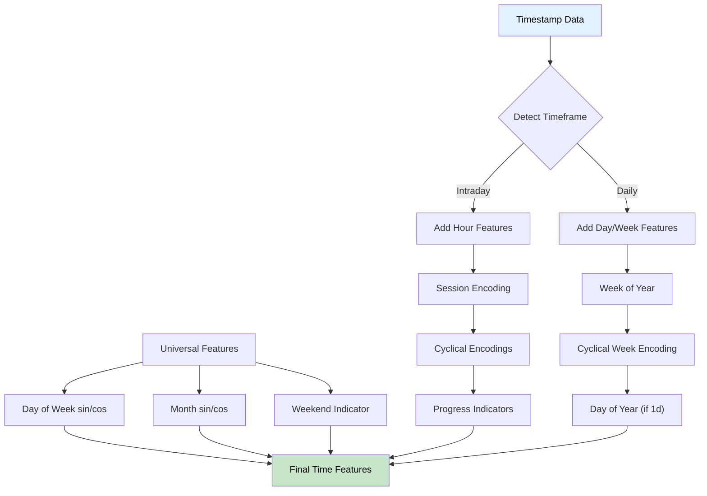
```mermaid
flowchart TD
    A["Timestamp Data"] --> B{"Detect Timeframe"}
    B -->|Intraday| C["Add Hour Features"]
    B -->|Daily| D["Add Day/Week Features"]

    C --> E["Session Encoding"]
    E --> F["Cyclical Encodings"]
    F --> G["Progress Indicators"]

    D --> H["Week of Year"]
    H --> I["Cyclical Week Encoding"]
    I --> J["Day of Year (if 1d)"]

    K["Universal Features"] --> L["Day of Week sin/cos"]
    K --> M["Month sin/cos"]
    K --> N["Weekend Indicator"]

    L --> O["Final Time Features"]
    M --> O
    N --> O
    G --> O
    J --> O

    style A fill:#e3f2fd,color:#000000
    style O fill:#c8e6c9,color:#000000
```

#### True Strength Index (TSI) Calculation

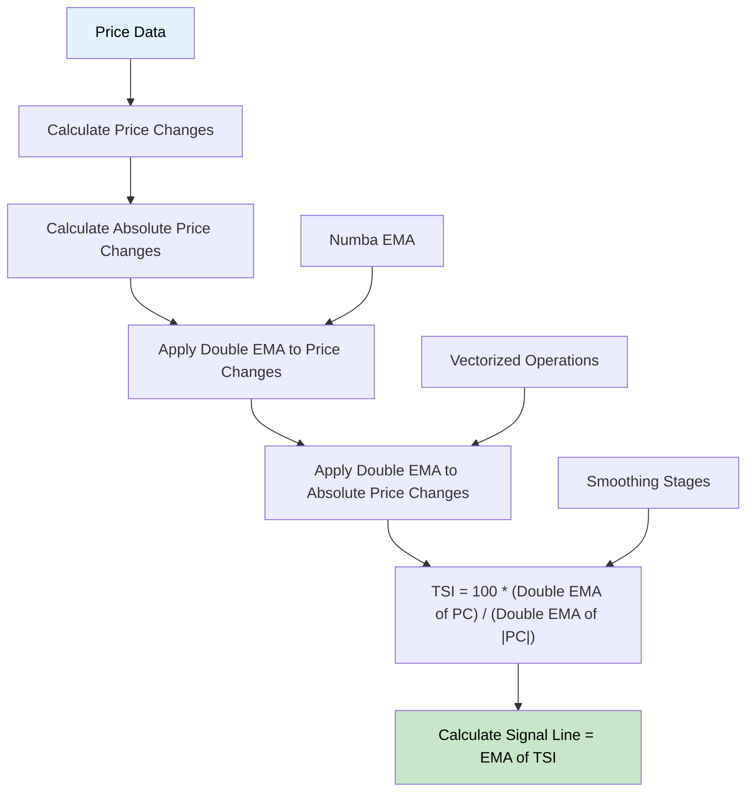
```mermaid
flowchart TD
    A["Price Data"] --> B["Calculate Price Changes"]
    B --> C["Calculate Absolute Price Changes"]
    C --> D["Apply Double EMA to Price Changes"]
    D --> E["Apply Double EMA to Absolute Price Changes"]
    E --> F["TSI = 100 * (Double EMA of PC) / (Double EMA of |PC|)"]
    F --> G["Calculate Signal Line = EMA of TSI"]

    H["Numba EMA"] --> D
    I["Vectorized Operations"] --> E
    J["Smoothing Stages"] --> F

    style A fill:#e3f2fd,color:#000000
    style G fill:#c8e6c9,color:#000000
```

#### Commodity Channel Index (CCI) Calculation

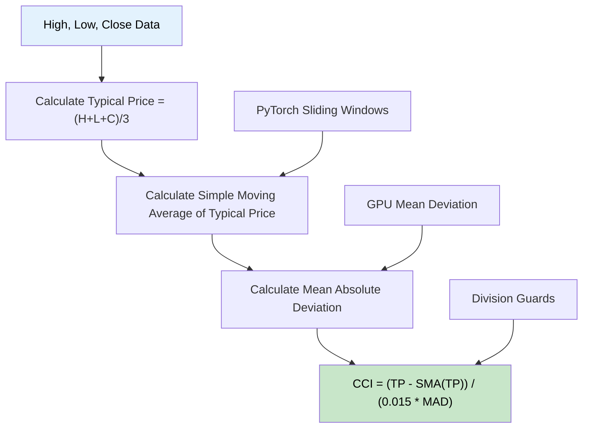
```mermaid
flowchart TD
    A["High, Low, Close Data"] --> B["Calculate Typical Price = (H+L+C)/3"]
    B --> C["Calculate Simple Moving Average of Typical Price"]
    C --> D["Calculate Mean Absolute Deviation"]
    D --> E["CCI = (TP - SMA(TP)) / (0.015 * MAD)"]

    F["PyTorch Sliding Windows"] --> C
    G["GPU Mean Deviation"] --> D
    H["Division Guards"] --> E

    style A fill:#e3f2fd,color:#000000
    style E fill:#c8e6c9,color:#000000
```

#### Chande Momentum Oscillator (CMO) Calculation

```mermaid
flowchart TD
    A["Price Data"] --> B["Calculate Price Changes"]
    B --> C["Separate Gains and Losses"]
    C --> D["Sum Gains over n periods"]
    C --> E["Sum Losses over n periods"]
    D --> F["CMO = 100 * (Sum Gains - Sum Losses) / (Sum Gains + Sum Losses)"]
    E --> F

    G["GPU Rolling Sums"] --> D
    H["Vectorized Separation"] --> C
    I["Safe Division"] --> F

    style A fill:#e3f2fd,color:#000000
    style F fill:#c8e6c9,color:#000000
```

#### Momentum Indicator Calculation

```mermaid
flowchart TD
    A["Price Data"] --> B["Current Price"]
    A --> C["Price n periods ago"]
    B --> D["Momentum = Current Price - Price(n periods ago)"]
    C --> D

    E["Vectorized Subtraction"] --> D
    F["GPU Acceleration"] --> E

    style A fill:#e3f2fd,color:#000000
    style D fill:#c8e6c9,color:#000000
```

#### Volatility Index Calculation

```mermaid
flowchart TD
    A["Price Data"] --> B["Calculate Percentage Returns"]
    B --> C["Select Annualization Factor"]
    C --> D["Rolling Standard Deviation"]
    D --> E["Annualized Volatility = StdDev * sqrt(AnnFactor) * 100"]
    E --> F["Apply EMA Smoothing"]

    G["PyTorch Operations"] --> B
    H["Timeframe Mapping"] --> C
    I["Vectorized StdDev"] --> D

    style A fill:#e3f2fd,color:#000000
    style F fill:#c8e6c9,color:#000000
```

#### Klinger Volume Oscillator (KVO) Calculation

```mermaid
flowchart TD
    A["Price Data"] --> B["Calculate Price Changes"]
    A --> C["Volume Data"]
    B --> D["Trend = Sign(Change) * Volume * 100"]
    C --> D
    D --> E["Calculate EMA(34) of Trend"]
    D --> F["Calculate EMA(13) of Trend"]
    E --> G["KVO = EMA(13) - EMA(34)"]
    F --> G

    H["PyTorch EMAs"] --> E
    I["Fast/Slow Parameters"] --> F

    style A fill:#e3f2fd,color:#000000
    style G fill:#c8e6c9,color:#000000
```

#### Volume Zone Oscillator (VZO) Calculation

```mermaid
flowchart TD
    A["Price Data"] --> B["Volume Data"]
    B --> C["Calculate Price Direction"]
    C --> D["Volume Price = Direction * Volume"]
    D --> E["EMA of Volume Price"]
    D --> F["EMA of Volume"]
    E --> G["VZO = 100 * (EMA(VP) / EMA(V))"]
    F --> G

    H["PyTorch EMAs"] --> E
    I["Safe Division"] --> G

    style A fill:#e3f2fd,color:#000000
    style G fill:#c8e6c9,color:#000000
```

#### Enhanced DMA (EDMA) Calculation

```mermaid
flowchart TD
    A["Price Data"] --> B["Calculate HEXP and LEXP"]
    B --> C["Calculate WMA of LEXP (h_len/2)"]
    C --> D["Calculate WMA of LEXP (h_len)"]
    D --> E["HMA Input = 2 * WMA(h_len/2) - WMA(h_len)"]
    E --> F["Calculate WMA of HMA Input (sqrt(h_len))"]

    G["Numba State Arrays"] --> B
    H["Dynamic Windows"] --> C
    I["Hull Integration"] --> E

    style A fill:#e3f2fd,color:#000000
    style F fill:#c8e6c9,color:#000000
```

#### Geometric Mean Moving Average (GMMA) Calculation

```mermaid
flowchart TD
    A["Price Data"] --> B["Convert to Log Scale"]
    B --> C["Handle Zeros and Negatives"]
    C --> D["Rolling Sum of Logs"]
    D --> E["Count Valid Values"]
    E --> F["Geometric Mean = exp(Sum Logs / Count)"]
    F --> G["Set to 0 if any zeros in window"]

    H["JAX Convolution"] --> D
    I["Zero Detection"] --> G
    J["NaN Handling"] --> C

    style A fill:#e3f2fd,color:#000000
    style G fill:#c8e6c9,color:#000000
```

#### Ehler's Adaptive Laguerre Filter (EALF) Calculation

```mermaid
flowchart TD
    A[Price Data] --> B[Initialize L0, L1, L2, L3]
    B --> C[For each new price x]
    C --> D[L0 = (1-gamma)*x + gamma*L0_prev]
    D --> E[L1 = -gamma*L0 + L0_prev + gamma*L1_prev]
    E --> F[L2 = -gamma*L1 + L1_prev + gamma*L2_prev]
    F --> G[L3 = -gamma*L2 + L2_prev + gamma*L3_prev]
    G --> H[EALF = (L0 + 2*L1 + 2*L2 + L3) / 6]

    I[JAX Scan Operation] --> C
    J[GPU Acceleration] --> I
    K[JIT Compilation] --> I

    style A fill:#e3f2fd,color:#000000
    style H fill:#c8e6c9,color:#000000
```

#### MESA Adaptive Moving Average (MAMA/FAMA) Calculation

```mermaid
flowchart TD
    A[Price Data] --> B[Calculate Detrender]
    B --> C[Calculate Quadrature]
    C --> D[Compute Phase]
    D --> E[Calculate Adaptive Alpha]
    E --> F[Update MAMA]
    F --> G[Update FAMA]
    
    H[Hilbert Transform] --> B
    I[Adaptive Parameters] --> E
    J[Two-Stage Smoothing] --> F
    
    style A fill:#e3f2fd
    style G fill:#c8e6c9
```

#### Range EMA (REMA) Calculation

```mermaid
flowchart TD
    A["Price Data"] --> B["Calculate Price Ranges"]
    B --> C["Calculate Range Means"]
    C --> D["Normalize Ranges"]
    D --> E["Adaptive Alpha = Base Alpha * (1 + lambda * Normalized Range)"]
    E --> F["REMA = alpha * Price + (1-alpha) * REMA_prev"]

    G["Rolling Operations"] --> B
    H["Clipping"] --> E
    I["Sequential Calculation"] --> F

    style A fill:#e3f2fd
    style F fill:#c8e6c9
```

#### Sine-Weighted Moving Average (SWMA) Calculation

```mermaid
flowchart TD
    A["Price Data"] --> B["Generate Sine Weights"]
    B --> C["Normalize Weights"]
    C --> D["Create Sliding Windows"]
    D --> E["Weighted Sum = Sum(Weight_i * Price_i)"]
    E --> F["SWMA = Weighted Sum / Sum of Weights"]

    G["PyTorch Sine Generation"] --> B
    H["Vectorized Windows"] --> D
    I["GPU Acceleration"] --> H

    style A fill:#e3f2fd
    style F fill:#c8e6c9
```

### Error Handling and Fallback System

```mermaid
flowchart TD
    A[Indicator Calculation] --> B{Data Valid?}
    B -->|No| C[Return NaN Series]
    B -->|Yes| D{Device Available?}
    D -->|GPU| E[Try PyTorch GPU]
    D -->|JAX| F[Try JAX JIT]
    D -->|CPU| G[Try Numba CPU]
    
    E --> H{GPU Success?}
    F --> I{JAX Success?}
    G --> J{Numba Success?}
    
    H -->|Yes| K[Return GPU Result]
    H -->|No| L[Fallback to CPU]
    I -->|Yes| M[Return JAX Result]
    I -->|No| N[Fallback to Numba]
    J -->|Yes| O[Return CPU Result]
    J -->|No| P[Fallback to Pandas]
    
    L --> O
    N --> P
    
    Q[Numerical Stability] --> A
    R[Error Logging] --> C
    R --> K
    R --> M
    R --> O
    R --> P
    
    style A fill:#e3f2fd,color:#000000
    style K fill:#c8e6c9,color:#000000
    style M fill:#c8e6c9,color:#000000
    style O fill:#c8e6c9,color:#000000
    style P fill:#c8e6c9,color:#000000
    style C fill:#ffcdd2,color:#000000
```

### Memory Management Flow

```mermaid
flowchart TD
    A[Large Dataset] --> B{Size > Memory Limit?}
    B -->|Yes| C[Chunk Processing]
    B -->|No| D[Full Processing]
    
    C --> E[Process in Batches]
    E --> F[Clear Memory After Each Chunk]
    F --> G[Combine Results]
    
    D --> H[Use Memory Pool]
    H --> I[Pre-allocated Arrays]
    I --> J[In-place Operations]
    J --> K[Garbage Collection]
    
    L[GPU Memory Pool] --> H
    M[CPU Memory Optimization] --> H
    
    G --> N[Return Final Result]
    K --> N
    
    style A fill:#e3f2fd,color:#000000
    style N fill:#c8e6c9,color:#000000
```

### Multi-threaded Processing Architecture

```mermaid
graph TD
    A[Input Data] --> B[Data Partitioner]
    B --> C[Thread 1: Chunk 1]
    B --> D[Thread 2: Chunk 2]
    B --> E[Thread N: Chunk N]
    
    C --> F[Indicator Set A]
    D --> F
    E --> F
    
    F --> G[Result Combiner]
    G --> H[Post-processing]
    H --> I[Final Output]
    
    J[Thread Pool Manager] --> C
    J --> D
    J --> E
    
    K[Progress Coordinator] --> F
    L[Memory Synchronizer] --> G
    
    style A fill:#e3f2fd,color:#000000
    style I fill:#c8e6c9,color:#000000
    style F fill:#fff3e0,color:#000000
```

### Real-time Processing Pipeline

```mermaid
flowchart TD
    A[Live Data Stream] --> B[Data Buffer]
    B --> C[Incremental Update]
    C --> D[Update Indicators]
    D --> E[Check Thresholds]
    E --> F[Generate Signals]
    F --> G[Update Output]
    
    H[Rolling Window] --> C
    I[Cached Calculations] --> D
    J[Signal Manager] --> F
    
    K[WebSocket/Files] --> A
    L[Database Update] --> G

    style A fill:#e3f2fd,color:#000000
    style G fill:#c8e6c9,color:#000000
```

## 💰 Price Source Formulas

The processor supports multiple price calculation formulas for technical indicators:

1. **close**: Standard close price (default)
2. **formula1**: `(open+close+3*(high+low))/8`
3. **formula2**: `close+high+low-2*open`
4. **formula3**: `(close+5*(high+low)-7*(open))/4`
5. **formula4**: `(open+close+5*(high+low))/12`
6. **conditional1**: `(close > open ? high : low)`
7. **conditional2**: `(ohlc4 > open ? high : low)` where `ohlc4 = (open+high+low+close)/4`

## ⏰ Time Features

The system automatically generates timeframe-appropriate features:

### Universal Features (All Timeframes)
- `day_of_week_sin/cos`: Cyclic day of week encoding
- `month_sin/cos`: Cyclic month encoding
- `is_weekend`: Weekend indicator

### Intraday Features (1m to 12h)
- `hour_sin/cos`: Cyclic hour encoding
- `session_encoded`: Trading session (Asia=0, Europe=1, America=2)
- `session`: Session labels
- `session_progress`: Progress within session
- `minute_sin/cos`: For 1-5 minute data

### Daily Features (1d+)
- `week_of_year`: ISO week number
- `week_sin/cos`: Cyclic week encoding
- `day_of_year_sin/cos`: Cyclic day of year (for 1d)
- `dominant_session`: Dominant trading session

## 🔧 Installation

### Dependencies

```bash
pip install pandas numpy torch jax numba scipy
```

### Optional (for GPU acceleration)
```bash
# For CUDA support
pip install torch --index-url https://download.pytorch.org/whl/cu118

# For additional JAX features
pip install jax[cuda]
```

### Required Python Version
- Python 3.8 or higher

## 📖 Usage

### Basic Usage

```python
from process_single import CryptoTAProcessor

# Initialize processor
processor = CryptoTAProcessor(
    csv_filename="crypto_data.csv",
    output_dir="processed_data",
    price_source="close",
    verbose=True
)

# Process and save
result_df = processor.process_and_save()
```

### Advanced Configuration

```python
# Custom indicators
custom_indicators = [
    {'name': 'SMA', 'periods': [20, 50]},
    {'name': 'EMA', 'periods': [12, 26]},
    {'name': 'RSI', 'periods': [14]},
    {'name': 'MACD', 'periods': []},
    {'name': 'KDJ', 'periods': [], 'price_source': 'close'},
    {'name': 'RVSI', 'periods': [14], 'mode': 'tfs', 'vol_len': 14},
    {'name': 'SAVITZKY_GOLAY', 'periods': [11, 21], 'poly_order': 3}
]

# Initialize with custom settings
processor = CryptoTAProcessor(
    csv_filename="btc_hourly.csv",
    ta_indicators=custom_indicators,
    output_dir="btc_processed",
    output_filename="btc_ta_features.csv",
    start_date="2023-01-01",
    price_source="formula1",  # Default price source
    verbose=True
)

# Process data
result_df = processor.process_and_save()
```

### Direct Indicator Usage

```python
from ta import TechnicalIndicators
import pandas as pd

# Create sample data
data = pd.Series([1, 2, 3, 4, 5, 6, 7, 8, 9, 10])

# Calculate indicators
sma_20 = TechnicalIndicators.sma(data, 20)
ema_12 = TechnicalIndicators.ema(data, 12)
rsi_14 = TechnicalIndicators.rsi(data, 14)
macd_line, signal_line, histogram = TechnicalIndicators.macd(data)
```

### Advanced Indicator Examples

```python
# RVSI with different modes
rvsi_tfs = TechnicalIndicators.rvsi(data, volume, length=14, mode='tfs', vol_len=14)
rvsi_kvo = TechnicalIndicators.rvsi(data, volume, length=14, mode='kvo', fast_x=13, slow_x=34)
rvsi_vzo = TechnicalIndicators.rvsi(data, volume, length=14, mode='vzo', z_len=14)

# KDJ with custom parameters
k, d, j = TechnicalIndicators.kdj(high, low, close, n=9)

# Savitzky-Golay with custom polynomial order
sg_filter = TechnicalIndicators.savitzky_golay(data, window_length=11, poly_order=2, implementation="rolling")

# Volume-weighted indicators
vwma = TechnicalIndicators.vwma(data, volume, period=20)
evwma = TechnicalIndicators.evwma(data, volume, period=20)
```

## 📊 Input Data Format

### Expected CSV Structure
The processor automatically detects OHLCV columns using flexible naming patterns:

```csv
timestamp,open,high,low,close,volume
2023-01-01 00:00:00,16500.0,16600.0,16400.0,16550.0,1250.5
2023-01-01 01:00:00,16550.0,16650.0,16500.0,16600.0,980.3
...
```

### Supported Column Names
- **Open**: `open`, `o`
- **High**: `high`, `h`
- **Low**: `low`, `l`
- **Close**: `close`, `c`
- **Volume**: `volume`, `v`

### Data Requirements
- First column should contain timestamps (automatically converted to datetime)
- Must contain at least: open, high, low, close columns
- Volume column is optional but required for volume-based indicators

## 🎯 Performance Optimizations

### GPU Acceleration
- **PyTorch**: Automatic GPU detection and utilization
- **JAX**: JIT compilation for mathematical operations
- **Numba**: CPU parallelization with `@jit` decorators

### Memory Management
- **In-place operations** to minimize memory usage
- **Streaming processing** for large datasets
- **Numerical stability checks** to prevent overflow/underflow

### Computational Efficiency
- **Vectorized operations** using tensor computations
- **Batch processing** for rolling window calculations
- **Optimized algorithms** with reduced computational complexity

### Caching Mechanisms
- **Price data caching** to avoid recalculating formulas
- **Progress tracking** with efficient progress bars
- **Smart fallbacks** for missing dependencies

## 🧪 Testing and Validation

### Numerical Stability Tests
```python
# Test with edge cases
test_data = pd.Series([1, 2, np.nan, 4, 5, np.inf, -np.inf, 8])
stable_data = TechnicalIndicators.ensure_numerical_stability(test_data)
```

### Performance Benchmarks
```python
import time

# Benchmark indicator calculation
start_time = time.time()
result = TechnicalIndicators.rsi(large_dataset, 14)
end_time = time.time()
print(f"Calculation time: {end_time - start_time:.4f} seconds")
```

### Accuracy Validation
- Compare results with established libraries (TA-Lib, pandas-ta)
- Validate against known mathematical formulas
- Test with synthetic data with known characteristics

## 🔄 Output Format

### Processed Data Structure
The output CSV contains:
1. **Original OHLCV data**
2. **Technical indicators** (named as `INDICATOR_PERIOD`)
3. **Time features** (timestamp, cyclical encodings)
4. **Optional metadata** (processing parameters, timestamps)

### Column Naming Convention
- `SMA_20`: Simple Moving Average with 20-period
- `EMA_12`: Exponential Moving Average with 12-period
- `RSI_14`: RSI with 14-period
- `MACD_LINE`: MACD main line
- `MACD_SIGNAL`: MACD signal line
- `MACD_HIST`: MACD histogram
- `KDJ_K`: KDJ K line
- `KDJ_D`: KDJ D line
- `KDJ_J`: KDJ J line
- `RVSI_14`: RVSI with 14-period and TFS mode
- `SG_11`: Savitzky-Golay with 11-point window

### Time Feature Columns
- `timestamp`: Original timestamp as column
- `day_of_week_sin/cos`: Cyclical day encoding
- `month_sin/cos`: Cyclical month encoding
- `hour_sin/cos`: Cyclical hour encoding
- `session_encoded`: Numeric session encoding
- `is_weekend`: Boolean weekend indicator

## 🛡️ Error Handling

### Graceful Degradation
- **Missing columns**: Falls back to available data
- **Insufficient data**: Returns NaN values for affected calculations
- **GPU unavailability**: Automatically falls back to CPU
- **Numerical errors**: Handles division by zero, infinity values

### Logging and Debugging
```python
# Enable verbose logging
processor = CryptoTAProcessor(
    csv_filename="data.csv",
    verbose=True,  # Enables detailed logging
    output_dir="output"
)
```

## 🚀 Advanced Use Cases

### 1. Multi-Timeframe Analysis
```python
# Process different timeframes
timeframes = ['1h', '4h', '1d']
for tf in timeframes:
    processor = CryptoTAProcessor(
        csv_filename=f"crypto_{tf}.csv",
        output_dir=f"processed_{tf}"
    )
    processor.process_and_save()
```

### 2. Custom Indicator Development
```python
class CustomIndicators(TechnicalIndicators):
    @staticmethod
    def custom_indicator(data, period):
        # Your custom implementation
        return data.rolling(period).mean() * 1.1
    
# Use custom indicator
custom_result = CustomIndicators.custom_indicator(data, 20)
```

### 3. Batch Processing
```python
import glob

csv_files = glob.glob("data/*.csv")
for csv_file in csv_files:
    processor = CryptoTAProcessor(
        csv_filename=csv_file,
        output_dir="batch_output",
        verbose=True
    )
    processor.process_and_save()
```

### 4. Real-time Processing
```python
def process_realtime_data(new_data_point):
    # Update processor with new data
    processor.load_data()
    # Calculate latest indicators
    latest_indicators = processor.calculate_technical_indicators()
    return latest_indicators.tail(1)
```

## 📈 Performance Metrics

### Benchmark Results (Typical)
- **10,000 data points**: ~0.5-2 seconds (CPU), ~0.1-0.5 seconds (GPU)
- **100,000 data points**: ~5-20 seconds (CPU), ~1-5 seconds (GPU)
- **Memory usage**: ~2-4x input data size
- **GPU memory**: Variable based on data size and indicator complexity

### Scalability
- **Linear scaling** with data size for most indicators
- **Logarithmic scaling** for some rolling window operations
- **Parallel processing** capabilities for batch operations

## 🤝 Contributing

### Adding New Indicators
1. Inherit from `TechnicalIndicators` class
2. Implement static method with appropriate optimizations
3. Add to the indicator registry in `process_single.py`
4. Include comprehensive documentation and tests

### Performance Improvements
- Profile using `cProfile` or `line_profiler`
- Optimize hot paths with Numba/PyTorch
- Minimize memory allocations
- Use vectorized operations where possible

## 📄 License

This project is provided as-is for educational and research purposes. Please ensure compliance with relevant financial data licensing terms when using real market data.

## 🆘 Troubleshooting

### Common Issues

1. **CUDA out of memory**
   ```python
   # Force CPU usage
   device = 'cpu'  # Override GPU detection
   ```

2. **Missing OHLCV columns**
   ```python
   # Check column names
   df.columns.tolist()
   # Rename columns to match expected patterns
   df.rename(columns={'price': 'close'}, inplace=True)
   ```

3. **Performance issues**
   ```python
   # Disable progress bars for speed
   processor = CryptoTAProcessor(csv_filename="data.csv", verbose=False)
   ```

4. **Memory errors with large datasets**
   ```python
   # Process in chunks
   chunk_size = 10000
   for chunk in pd.read_csv("large_data.csv", chunksize=chunk_size):
       # Process chunk
   ```

### Getting Help

For technical issues:
1. Check the logging output with `verbose=True`
2. Verify input data format matches expected structure
3. Ensure all dependencies are properly installed
4. Test with a small sample dataset first

---

*This technical analysis toolkit is designed for educational and research purposes. Always validate results and consider market conditions when making financial decisions.*